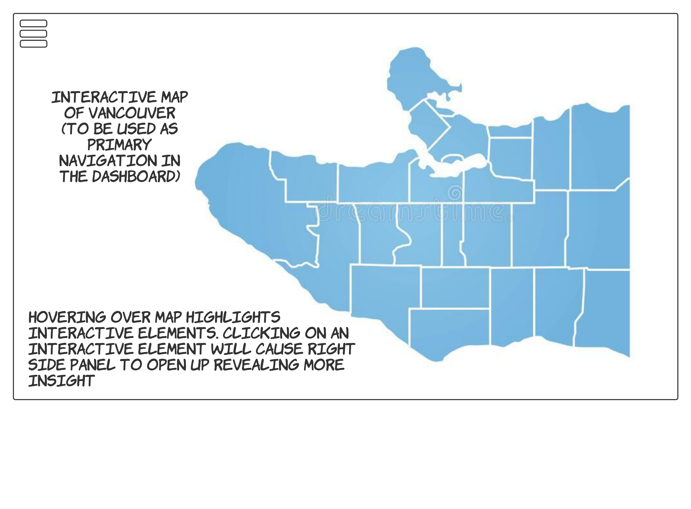
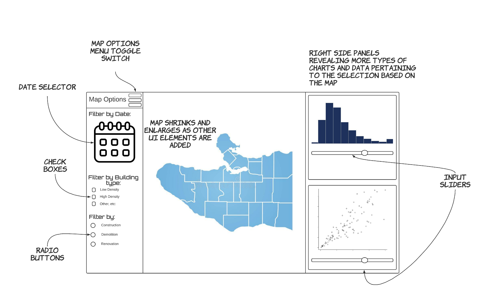

# Vancouver Building Permit Exploration
- authors: Spencer Gerlach, Alex Taciuk, Revathy Ponnambalam, Waiel Tinwala

This is a dashboard made with shiny app and is created for people or organizations in Vancouver that depend on development insights from building permit data, but are unable to access them due to various technical or other accessiblity constraints. The dashboards main landing page consists of just a map of the city of Vancouver and a button on the top left corner of the app. This map is interactive and can be zoomed in and out to move around and select different areas on the map as they get highlighted when the cursor hovers over them.

Clicking on the top left button brings up a left side panel revealing filtering options for the data. Clicking any highlighted part on the map will open a bigger right side panel with more visualizations such as bar charts, histograms, time lines, etc. These visualizations on the right panel may have their own sliders (or buttons) to tweak certain settings to obtain the users desired visualization.
 
 
 

# License
Licensed under the terms of the MIT license.
