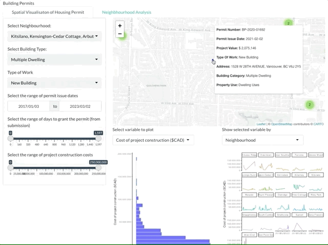
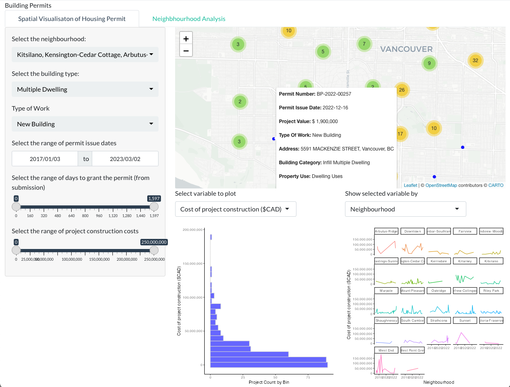
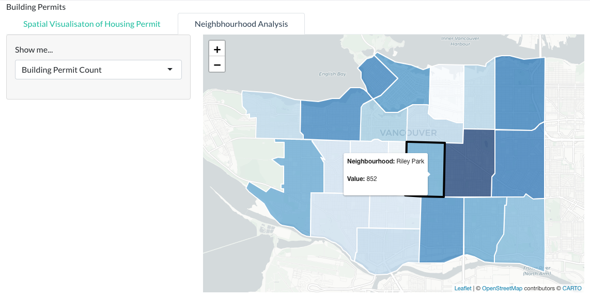

# Vancouver Building Permit Exploration

- Authors: Spencer Gerlach, Alex Taciuk, Revathy Ponnambalam, Waiel Tinwala

Shiny App link : https://ataciuk.shinyapps.io/dsci532-group19-buildingpermits/

## Dashboard Motivation: Why?

Our dashboard is a shiny app created for people or organizations in Vancouver that depend on development insights from building permit data, but are unable to access them due to various technical or other accessiblity constraints. 

## Dashboard Contents: What?

Upon launch of the shiny app, users are met with a detailed summary of Vancouver building permit data. Users can toggle between two different tabs, showing different levels of summary information. The two tabs are described below. 

### Tab 1: Spatial Visualization of Housing Permit

> Users can explore different data filters using the filter pane on the left side. These filters will update the three main visuals on the page. Users can filter permits based on neighbourhood, building type, approval date range, etc.

The summary visuals on page 1 are comprised of:

1. **Permit Location Map:** Users can find individual permits on a map, and hover over each permit location to see an expanded list of information about the permit.

2. **Summary Histogram:** Users can view the distribution of permits based on the project value (CAD), or by the number of days elapsed before the building permit was approved.

3. **Faceted Line Chart:** Users can view the trends in project value or days for approval over time. Users can decide to facet charts by neighbourhood (multiple options) or by the type of building  (two options).

#### Example View:

### Tab 2: Neighbourhood Analysis

> Users can explore building permit data summarized to Vancouver's neighbourhood boundaries. Users can decide between various summary statistics.

- Users can first decide between various building permit summary statistics using the filter pane on the left side of the page. Options include various statistics for project value ($CAD), permit approval timelines, 
- Based on the selection, the neighbourhood map will dynamically update to show that statistic. Darker colors represent larger values.
- Users can hover their mouse over each neighbourhood to see the neighbourhood name and the value of the chosen summary statistic.

#### Example View:

## Contribution to the Dashboard: How?

Interested in contributing to this dashboard? Instructions and guidelines for contributing to our project can be found in the `CONTRIBUTING.MD` file in this repository.

We are excited about this product, and welcome any suggestions for improvement. Specific suggestions about use-cases can help our team develop a truly useful app that people will use and build value from.

Thank you for considering contributing to our dashboard!

# License
Licensed under the terms of the MIT license.
